<!-- animated contribution graph: real data, boxes reveal cell by cell
     (regenerated daily by .github/workflows/update-profile-art.yml) -->

<h3><code>vetle@github ~ $ ./contributions.sh</code></h3>

 
 

<!-- hero: monochrome ASCII portrait (types itself in row by row) beside a
     neofetch-style info card (fades in line by line). widths are picked so
     both panels land at the same rendered height, and 370 + 490 = 860 lines
     the edges up with the heatmap above.
     portrait: python scripts/prep_photo.py <photo> && python scripts/make_ascii_svg.py
     card:     python scripts/make_info_card.py -->

<h3><code>vetle@github ~ $ whoami</code></h3>

<table>
<tr>
<td valign="top"></td>
<td valign="top"></td>
</tr>
</table>

 

